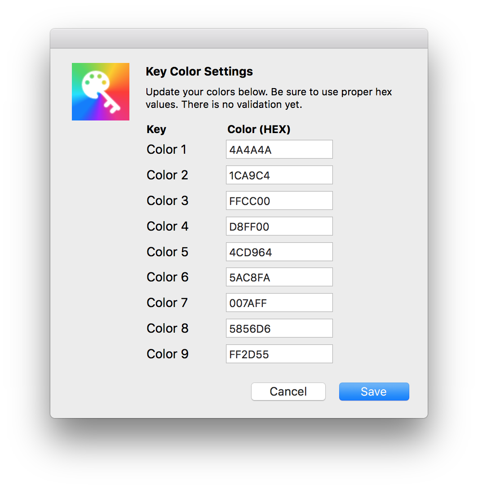

# Key Color

_Key Color_ (🗝🌈) is a Sketch plugin to easily apply colors via the keyboard.

## Usage

Select a layer (or layers) and use one of the following keyboard commands.

<kbd>^ Ctrl</kbd> + <kbd>1 - 9</kbd> = Apply Fill Color to Selection

<kbd>^ Ctrl</kbd> + <kbd>shift</kbd> + <kbd>1 - 9</kbd> = Apply Border Color to Selection

You can also set custom colors via the settings (Plugins > Key Color > Settings).

## Todos

- Support group selection
- Add hex validation
- Make it easier to use colors with opacity
- Add gradient support

## Install

1. [Download](https://github.com/KevinGutowski/keyColor/releases/download/v1.0.1/keyColor.sketchplugin.zip) the plugin
2. Unzip the file
3. Double-click the file, 'keyColor.sketchplugin'

## Contribute

This plugin is in active development. Please submit bugs 🐛.

## Contact

* Follow [@kevgski](https://twitter.com/kevgski) on Twitter
* Email <kskiviolin@gmail.com>